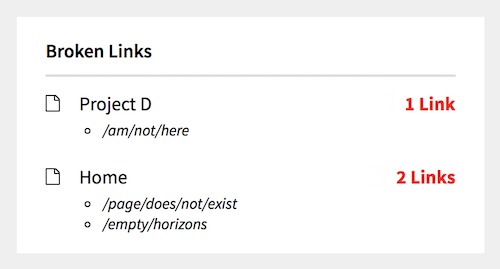

# 🔗 Broken Links Checker Widget by [@wottpal](https://twitter.com/wottpal)

<!-- Buttons -->

A panel-widget for the [Kirby CMS](https://getkirby.com) which shows broken links within the pages.

_Disclaimer:_ This is a pre-release and it is not feature-complete yet. (see *Roadmap* below)

# Installation

Use [Kirby's CLI](https://github.com/getkirby/cli) and install the plugin via: `kirby plugin:install wottpal/kirby-broken-links-widget` or place the repo manually under `site/plugins` (without the `kirby-` prefix).

🎉 **That's it.**

# Options

The following options can be set globally in your `config.php` with `c::set($key, $value = null)`. You can also set multiple keys with `c::set([$key => $value, ..])`. 🤓

**Please prefix every key with `broken-links.`!**

key               | default | description
----------------- | ------- | ------------------------------------------------
`include-external`     | `false`     | Not only test for internal links but also for external ones.*
`include-fields`     | `['text']`     | Use other fields than `text` to search for broken links.
`exclude-pages`     | `[]`     | Page-IDs to exclude from broken link search.
`exclude-links`     | `['/error']`     | Page-IDs or external links to exclude from broken link search.

\* **Not recommended yet because it only works synchonously with the page-load of your panel which will slow everything quite down a bit.**

# Changelog

Have a look at the [releases page](https://github.com/wottpal/kirby-anchor-headings/releases).

# Roadmap

- [x] Make pages excludable
- [x] Make fields user-definable
- [ ] Do checks asynchronously
- [ ] Check for internet-connection (if external links are enabled)

# 💰‍ Pricing
Just kidding. This plugin is totally free. Please consider following [me](https://twitter.com/wottpal) on Twitter if it saved your day.

You can also check out one of [my other Kirby-plugins](https://wottpal.com/items/my-kirby-plugins):

* [Lightbox-Gallery](https://github.com/wottpal/kirby-lightbox-gallery) - Easily inline beautifully aligned galleries with lightbox-support powered by PhotoSwipe.
* [HTML5-Video Kirbytag](https://github.com/wottpal/kirby-video) - Adds a kirbytag for embedding HTML5-videos with a variety of features.
* [Anchor-Headings](https://github.com/wottpal/kirby-anchor-headings) - A kirby field-method which enumerates heading-elements, generates IDs for anchor-links and inserts custom markup based on your needs.
